## Descrição do processo de ETL

As fontes de dados utilizadas estão espalhadas em arquivos CSV disponibilizados pela Câmara
de Deputados Federais, APIs e um arquivo CSV de cadastro de pessoas jurídicas extraído de dados
disponibilizados pela Receita Federal. Essas fontes estão listadas [aqui](../README.md#fontes-de-dados)

### Visão geral

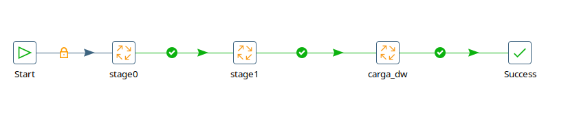
<sup>Processo de ETL dividio em 3 etapas: *stage0*, *stage1* e carga</sup>

Como pode ser visto na figura acima, o processo foi dividido em três macro etapas: *stage0*, *stage1* e carga.

### Extração

A fase de extração no projeto foi nomeada de *stage0*. Como os dados não estavam disponíveis originalmente
em um banco relacional essa fase faz a carga dos dados brutos em tabelas do Postgres.

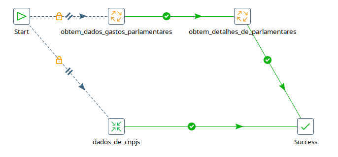
<sup>Steps do *stage0* ou extração</sup>

#### *Step*: Obtém dados gastos parlamentares

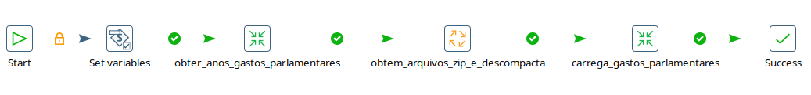
<sup>Visão macro do *step* Obtém dados de gastos parlamentares</sup>

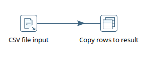
<sup>Obtém a lista de anos como parâmetro</sup>

Os dados de gastos parlamentares estão separados em arquivos CSV que são atualizados diariamente,
e consolidados anualmente. Para informar ao processo de ETL quais anos são alvo de extração,
informa-se em um arquivo CSV a lista desses anos. A partir daí, o PDI irá baixar um
a um dos arquivos de dados, descompactados e então carregados na tabela *st0_gastos*.

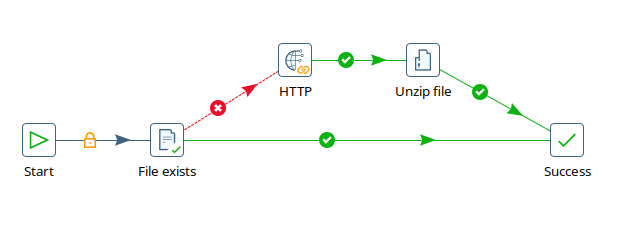
<sup>O PDI verifica se o arquivo zip já existe, senão faz o download e então os extrai</sup>

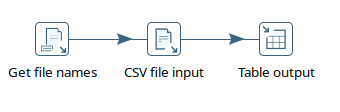
<sup>Na última etapa deste *step*, o PDI faz a carga dos dados na tabela *st0_gastos*</sup>

#### *Step*: Obtém detalhes de parlamentares

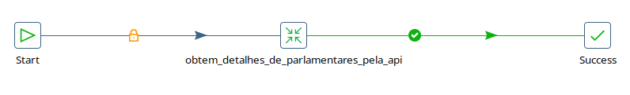
<sup>Visão macro do *step*</sup>

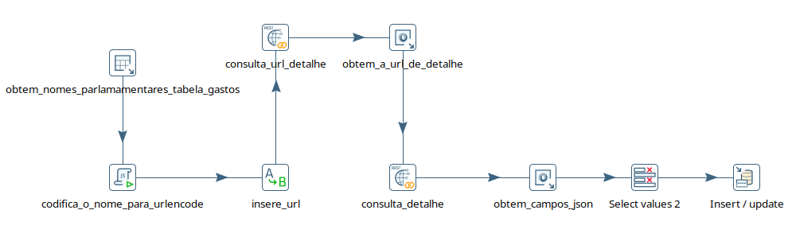
<sup>Visão detalhada do *step*: Obtém detalhes de parlamentares</sup>

A partir dos dados de gastos de parlamentares, consome-se uma API pública da câmara para se obter 
detalhes desses parlamentares, tais como sexo, data de nascimento, nível de escolaridade, etc.
Idealmente, seria possível obter essas informções fazendo somente um acesso a essa API, entretanto,
devido a falhas na consistência dos dados de gastos, é preciso primeiro buscar um ID do parlamentar
a partir do seu nome, para então obter os detalhes.

#### *Step*: Obtém dados de CNPJ

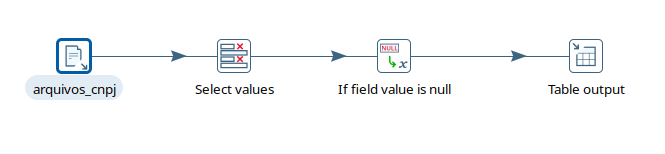
<sup>*Step*: Obtém dados de CNPJ</sup>

Nesse *step* o PDI irá abrir um arquivo CSV que contém os dados de CNPJ criado a partir de 
dados disponibilizados pela Receita Federal. Um tratamento mínimo aqui é executado transformando
alguns campos com valor *NULL*.

### Tratamento

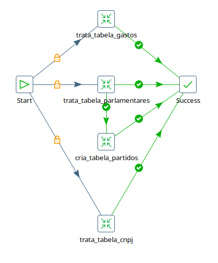
<sup>Visão macro do *stage1*: Trata tabela gastos, trata tabela parlamentares, trata tabela CNPJ, cria tabela partidos</sup>

Uma vez que os dados brutos estão todos carregados no banco de dados, fica mais fácil a análise
dos dados, da estrutura e de como podem se relacionar.

#### *Step*: Trata tabela de gastos

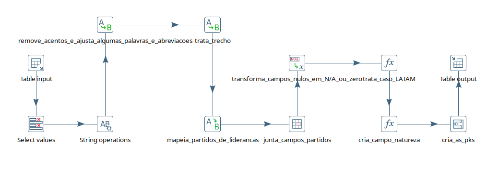
<sup>Tratamentos aplicados à tabela de gastos</sup>

Neste *step* são realizados alguns tratamentos na tabela st0_gastos:
1. Carrega tabela st0_gastos do Postgres;
2. Seleciona os campos de interesse;
3. Passa campos de texto para caixa alta;
4. Transformações de *string* em alguns campos:
    1. Remove acentuação, cedilha, e pontuação indevida;
    1. Trata o "DO" da sigla de partidos para "do";
    1. Converte "PATRI", "PODE" e "DEM" em "PATRIOTAS", "PODEMOS" e "DEMOCRATAS", repectivamente;
    1. Converte "SDD" em "SOLIDARIEDADE";
    1. Converte "PARTIDO REPUBLICANO DA ORDEM SOCIAL" em "PROS";
    1. Converte "MDB", "PL*", "MDB*", "PP**" em "PMDB", "PL", "PMDB" e "PP", respectivamente;
5. Aplica alguns tratamentos de string no campo "txttrecho" para torná-lo um pouco mais legível;
6. Preenche a coluna da sigla de partido quando o gasto é de liderança de partido;
7. Transforma campos *NULL* em "N/A" quando um campo texto, e 0, quando numérico;
8. Cria um campo novo chamado "natureza" indicando a natureza jurídica do fornecedor, identificando, se o campo txtcnpjcpf possui um CNPJ ou um CPF;
9. Carrega no banco de dados na tabela *st1_gastos*;

#### *Step*: Trata tabela de parlamentares

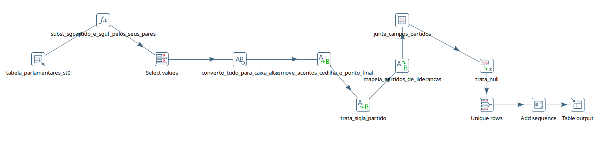
<sup>*Step*: Trata tabela de parlamentares</sup>

Deveria ser possível relacionar os parlamentares da tabela de gastos com a tabela de parlamentares pelo
campo idecadastro, contudo, alguns dados estão inconsistentes e por isso faz-se uma correlação das tabelas
pelos nomes dos parlamentares, sem acentos e em caixa baixa, trazendo todos os dados das duas tabelas,
pois alguns podem ser complementares.

Neste *step*, faz-se:
1. Carga dos dados unificados de st0_gastos e st0_parlamentares, pelo nome dos parlamentares;
2. Utiliza sigla da UF da tabela de gastos ou de parlamentares, o que estiver disponpivel pois alguns são *NULL*;
3. Seleciona apenas os campos a serem utilizados;
4. Converte todas as *strings* para caixa alta;
5. Remove acentos, cedilha e pontuações (como no passo 4 do [tratamento de gastos](#step-trata-tabela-de-gastos));
6. Preenche a coluna da sigla de partido quando o gasto é de liderança de partido;
7. Transforma campos *NULL* em "N/A" quando um campo texto, e 0, quando numérico;
8. Garante que as linhas são únicas;
9. Adicione uma chave primária;
10. Carrega no banco de dados na tabela *st1_parlamentares*;

#### *Step*: Cria tabela de partidos

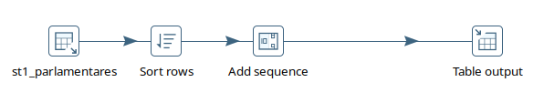
<sup>*Step*: Cria tabela de partidos</sup>

O modelo multi-dimensional prevê a existência de uma dimensão partido. Como não temos uma 
tabela específica para esta dimensão nas fases anteriores, criamos aqui esta tabela.
Esse *step* é bastante simples. Essencialmente faz-se uma consulta à tabela *st1_paralamentares* (dados já tratados)
retornando uma lista de valores únicos para as siglas de partidos.

```
SELECT
  DISTINCT sg_partido
FROM "public".st1_parlamentares
```

Em seguida, é adicionada uma chave primária sequencial.
Por último, é feita a carga na tabela *st1_partidos* no Postgres.

#### *Step*: Trata tabela de CNPJ

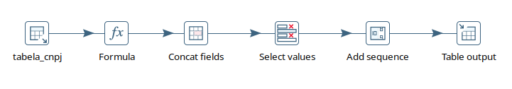

Neste *step*, faz-se:
1. Os dados são carregados da *st0_cnpj* de todos os CNPJ que aparecem na tabela de gastos (*st0_gastos*);
2. Se o nome fantasia não existir, é utilizado a razão social;
3. Na tabela original de CNPJ quando o fornecedor está no exterior, o campo município é *NULL* e o campo nm_cidade_exterior é preenchido. Para o DW, utilizamos somente município mas fazemos o merge desses dois campos;
4. Seleção dos campos que serão utilizados;
5. Adição da chave primária sequencial;
6. Carga no banco de dados na tabela *st1_cnpj*;

### Carga

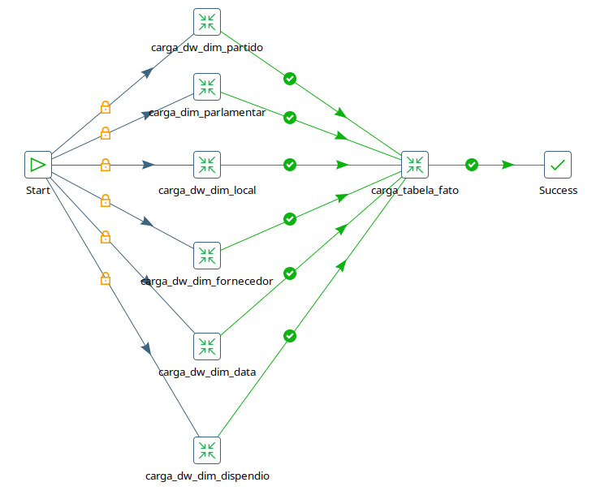
<sup>Visão macro da fase de carga</sup>

Nesta fase do ET**L**, são criadas as tabelas de dimensões:
- dim_partido;
- dim_data;
- dim_local;
- dim_parlamentar;
- dim_dispendio;
- dim_fornecedor;

E a fato: ft_gastos. 

#### dim_partido

Antes de fazer a carga dos dados, cria-se a tabela dim_partido:
```
CREATE TABLE dw.dim_partido
(
    sk_partido serial PRIMARY KEY,
    nk_partido integer NOT NULL,
    sg_partido character varying(16) NOT NULL DEFAULT 'N/A'::character varying
);
```

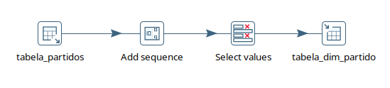
<sup>Carga da dimensão partido</sup>

Como se vê acima, esse *step* é bastante simples, e a "inteligência" está toda no SELECT
feito para se obter os dados de partidos da *st1_partidos*:

```
SELECT
  sg_partido
, id
FROM "public".st1_partidos
```

Em seguida é preenchido os valores para *sk_partido*, renomeia-se *id* para *nk_partido* e então a carga.

#### dim_parlamentar

Antes de fazer a carga dos dados, cria-se a tabela dim_parlamentar:
```
CREATE TABLE dw.dim_parlamentar
(
    sk_parlamentar serial PRIMARY KEY,
    nm_parlamentar character varying(36) NOT NULL,
    sexo character varying(10) NOT NULL DEFAULT 'N/A'::character varying,
    dt_nascimento date NOT NULL,
    sg_estado_eleitor character(3) NOT NULL DEFAULT 'N/A'::bpchar,
    escolaridade character varying(24) NOT NULL DEFAULT 'N/A'::character varying,
    nk_parlamentar integer
);
```

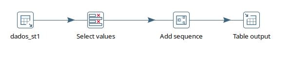
<sup>Carga da dimensão parlamentar</sup>

Os dados da dimensão parlamentar são obtidos da tabela *st1_parlamentares*.

```
SELECT p1.nm_eleitoral, p1.sg_uf, p1.sexo, p1.dt_nascimento, p1.escolaridade, p1.id
FROM st1_parlamentares p1
```

Renomeia-se *nm_eleitoral* para *nm_parlamentar*, *sg_uf* para *sg_estado_eleitor*, e *id* para *nk_parlamentar*.
Adiciona-se os valores de *sk_parlamentar* e então é feita a carga.

#### dim_local

Antes de fazer a carga dos dados, cria-se a tabela dim_local:
```
CREATE TABLE dw.dim_local
(
    sk_local serial PRIMARY KEY,
    nm_cidade character varying(32) NOT NULL DEFAULT 'N/A'::character varying,
    sg_estado character(3) NOT NULL DEFAULT 'N/A'::bpchar,
    nm_pais character varying(40) NOT NULL DEFAULT 'N/A'::character varying
);
```

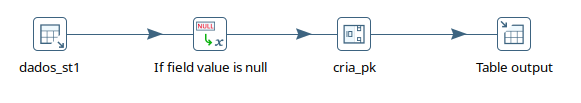
<sup>Carga da dimensão local</sup>

Os dados da dimensão local são obtidos do cruzamento das tabelas *st1_gastos* e *st1_cnpj*.
A dimensão local representa a localidade que recebeu os valores gastos pelos parlamentares.
Como alguns (poucos) gastos possuem um CPF como fornecedor, não é possível estabelecer o local para
este gasto. Por isso é feito um *FULL JOIN* das tabelas de gastos e de CNPJ para em seguida
se aplicar "N/A" onde não houver localização exata.

```
SELECT DISTINCT c1.cidade, c1.nm_pais, c1.uf
FROM st1_gastos g1 
FULL JOIN st1_cnpj c1 ON c1.cnpj = g1.cnpjcpf
```

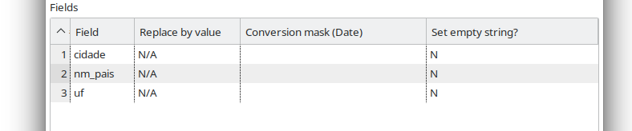
<sup>Para os casos sem localização, os campos recebem "N/A"</sup>

Uma vez carregados os dados das tabelas do *stage1*, é tratado o caso de gastos sem localização.
Então é criada a *sk_local* e os dados são adicionados ao banco.

#### dim_fornecedor

Antes de fazer a carga dos dados, cria-se a tabela dim_fornecedor:
```
CREATE TABLE dw.dim_fornecedor
(
    sk_fornecedor serial PRIMARY KEY,
    natureza character varying(8) NOT NULL,
    nm_fornecedor character varying(150) NOT NULL DEFAULT 'N/A'::character varying,
    cadastro character varying(24) NOT NULL
);
```

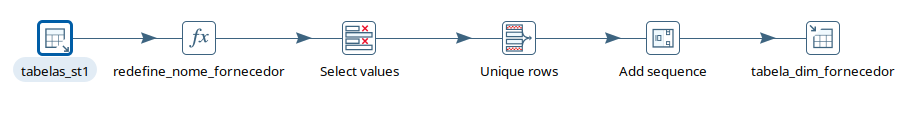
<sup>Carga da dimensão fornecedor</sup>

A dimensão fornecedor pode ser tanto uma pessoa física ou jurídica. Quando é uma pessoa jurídica,
os dados serão os presentes na tabela *st1_cnpj*, quando é pessoa física, os dados estão na tabela
de gastos, *st1_gastos*.

Esses dados são obtidos assim:

```
SELECT DISTINCT g1.cnpjcpf as cadastro, c1.nome_fantasia, g1.nm_fornecedor, g1.natureza
FROM st1_gastos g1 
FULL JOIN st1_cnpj c1 ON c1.cnpj = g1.cnpjcpf
```
Uma vez carregados os dados das tabelas do *stage1*, é tratado o caso de gastos pagos a pessoas físicas.
Quando é uma pessoa física, o campo *nome_fantasia* é (como esperado) *NULL*, então se na tabela de gastos,
o campo *nm_fornecedor* é utilizado.

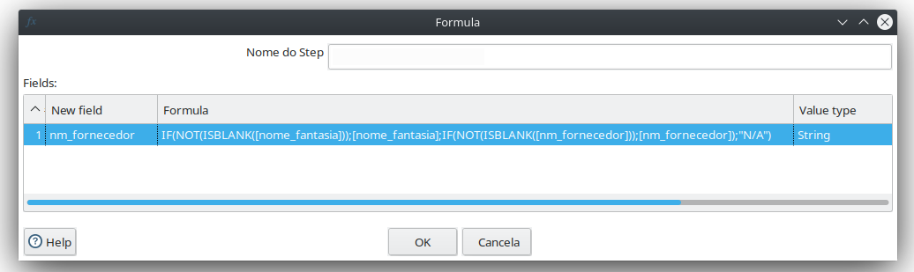
<sup>Pessoas físicas terão campo *nm_fornecedor* da tabela de gastos</sup>

Como esta etapa anterior pode gerar registros repetidos, o próximo *step* descarta essas
repetições. Em seguida, são criados os valores para *sk_fornecedor* e então é feita a carga no banco.

#### dim_dispendio

Antes de fazer a carga dos dados, cria-se a tabela dim_dispendio:
```
CREATE TABLE dw.dim_dispendio
(
    sk_dispendio serial PRIMARY KEY,
    descricao character varying(60) NOT NULL,
    nm_passageiro character varying(120) NOT NULL DEFAULT 'N/A'::character varying,
    trecho character varying(100) NOT NULL DEFAULT 'N/A'::character varying,
    especificacao character varying(20) NOT NULL DEFAULT 'N/A'::character varying
);
```

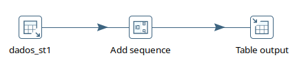
<sup>Carga da dimensão dispendio</sup>

Os dados da dimensão dispendio são obtidos exclusivamente da tabela de gastos.

Esses dados são obtidos assim:

```
SELECT DISTINCT g1.tx_descricao, g1.nm_passageiro, g1.trecho, g1.especificacao
FROM st1_gastos g1
```

Antes da carga no banco só é feita a adição dos valores para a *sk_dispendio*.

#### dim_data

Antes de fazer a carga dos dados, cria-se a tabela dim_data:
```
CREATE TABLE dw.dim_data
(
    sk_data serial PRIMARY KEY,
    nk_data date NOT NULL,
    desc_data_completa character varying(60) NOT NULL,
    nr_ano integer NOT NULL,
    nm_trimestre character varying(20) NOT NULL,
    nr_ano_trimestre character varying(20) NOT NULL,
    nr_mes integer NOT NULL,
    nm_mes character varying(20) NOT NULL,
    ano_mes character varying(20) NOT NULL,
    nr_semana integer NOT NULL,
    ano_semana character varying(20) NOT NULL,
    nr_dia integer NOT NULL,
    nr_dia_ano integer NOT NULL,
    nm_dia_semana character varying(20) NOT NULL,
    flag_final_semana character(3) NOT NULL,
    flag_feriado character(3) NOT NULL,
    nm_feriado character varying(60) NOT NULL,
    dt_final timestamp without time zone NOT NULL,
    dt_carga timestamp without time zone NOT NULL
);
```

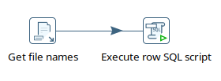
<sup>Carga da dimensão data</sup>

Os dados da dimensão data são gerados pelo *script*:

```
insert into "dw".dim_data
select to_number(to_char(datum,'yyyymmdd'), '99999999') as sk_tempo,
datum as nk_data,
to_char(datum,'dd/mm/yyyy') as data_completa_formatada,
extract (year from datum) as nr_ano,
'T' || to_char(datum, 'q') as nm_trimestre,
to_char(datum, '"T"q/yyyy') as nr_ano_trimenstre,
extract(month from datum) as nr_mes,
to_char(datum, 'tmMonth') as nm_mes,
to_char(datum, 'yyyy/mm') as nr_ano_nr_mes,
extract(week from datum) as nr_semana,
to_char(datum, 'iyyy/iw') as nr_ano_nr_semana,
extract(day from datum) as nr_dia,
extract(doy from datum) as nr_dia_ano,
to_char(datum, 'tmDay') as nm_dia_semana,
case when extract(isodow from datum) in (6, 7) then 'Sim' else 'Não'
end as flag_final_semana,
case when to_char(datum, 'mmdd') in ('0101','0421','0501','0907','1012','1102','1115','1120','1225') then 'Sim' else 'Não'
end as flag_feriado,
case 
---incluir aqui os feriados
when to_char(datum, 'mmdd') = '0101' then 'Ano Novo' 
when to_char(datum, 'mmdd') = '0421' then 'Tiradentes'
when to_char(datum, 'mmdd') = '0501' then 'Dia do Trabalhador'
when to_char(datum, 'mmdd') = '0907' then 'Dia da Pátria' 
when to_char(datum, 'mmdd') = '1012' then 'Nossa Senhora Aparecida' 
when to_char(datum, 'mmdd') = '1102' then 'Finados' 
when to_char(datum, 'mmdd') = '1115' then 'Proclamação da República'
when to_char(datum, 'mmdd') = '1120' then 'Dia da Consciência Negra'
when to_char(datum, 'mmdd') = '1225' then 'Natal' 
else 'Não é Feriado'

end as nm_feriado,
'2199-12-31',
current_date as data_carga
from (
select '2005-12-31'::date + sequence.day as datum
from generate_series(0,5845) as sequence(day)
group by sequence.day
) dq
order by 1;
```

#### ft_gastos

Antes de fazer a carga dos dados, cria-se a tabela ft_gastos:
```
CREATE TABLE dw.ft_gastos
(
    sk_partido integer NOT NULL,
    sk_fornecedor integer NOT NULL,
    sk_dispendio integer NOT NULL,
    sk_data integer NOT NULL,
    sk_local integer NOT NULL,
    vl_glosa real NOT NULL,
    vl_restituicao real NOT NULL,
    vl_documento real NOT NULL,
    vl_liquido real NOT NULL,
    legislatura integer NOT NULL,
    sk_parlamentar integer NOT NULL,
    sk_gastos serial PRIMARY KEY,
    CONSTRAINT dim_data_ft_gastos_fk FOREIGN KEY (sk_data)
        REFERENCES dw.dim_data (sk_data),
    CONSTRAINT dim_dispendio_ft_gastos_fk FOREIGN KEY (sk_dispendio)
        REFERENCES dw.dim_dispendio (sk_dispendio),
    CONSTRAINT dim_fornecedor_ft_gastos_fk FOREIGN KEY (sk_fornecedor)
        REFERENCES dw.dim_fornecedor (sk_fornecedor),
    CONSTRAINT dim_local_ft_gastos_fk FOREIGN KEY (sk_local)
        REFERENCES dw.dim_local (sk_local),
    CONSTRAINT dim_parlamentar_ft_gastos_fk FOREIGN KEY (sk_parlamentar)
        REFERENCES dw.dim_parlamentar (sk_parlamentar),
    CONSTRAINT dim_partido_ft_gastos_fk FOREIGN KEY (sk_partido)
        REFERENCES dw.dim_partido (sk_partido)
);
```

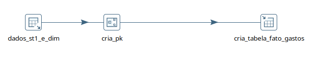
<sup>Carga da tabela fato gastos</sup>

Os dados da tabela fato precisam incluir os atributos do fato mas também todas as *surrogate keys*
das dimensões. Uma vez que se tenha esse conjunto, adiciona-se os valores da primary key *sk_gastos* e é feita a carga. 

Esses dados são obtidos com o seguinte código SQL:

```
SELECT f1.sk_fornecedor, l1.sk_local, s1.sk_dispendio, t1.sk_partido, d1.sk_data, p1.sk_parlamentar, g1.vl_documento, g1.vl_glosa, g1.vl_liquido, g1.vl_restituicao, g1.legislatura
FROM "public".st1_gastos g1, "dw".dim_parlamentar p1, "dw".dim_data d1, "dw".dim_partido t1, "dw".dim_dispendio s1, "dw".dim_local l1, st1_cnpj c1, "dw".dim_fornecedor f1
WHERE g1.nm_parlamentar = p1.nm_parlamentar
	AND g1.dt_emissao = d1.nk_data
	AND g1.sg_partido = t1.sg_partido
	AND g1.tx_descricao = s1.descricao
	AND g1.especificacao = s1.especificacao
	AND g1.nm_passageiro = s1.nm_passageiro
	AND g1.trecho = s1.trecho
	AND f1.cadastro = c1.cnpj
	AND c1.cidade = l1.nm_cidade
	AND c1.nm_pais = l1.nm_pais
	AND c1.uf = l1.sg_estado
	AND f1.cadastro = g1.cnpjcpf
;
```
